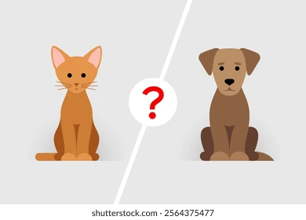

<p align="center">
  
</p>

<h1 align="center">🐱 Cat vs Dog Classifier 🐶</h1>

<p align="center">
  Image Classification Model created with Google Teachable Machine
</p>

---

## Overview

This project contains an image classification model capable of distinguishing between **cats** and **dogs**.

The model was trained using **Google Teachable Machine** and exported in **TensorFlow.js** format.

---

## Classes

* 🐱 Cat
* 🐶 Dog

---

## Repository Contents

```text
.
├── cats/
│   └── sample images
├── dogs/
│   └── sample images
├── model.json
├── metadata.json
└── weights.bin
```

---

## Sample Images

The repository includes:

* 50 cat images
* 50 dog images

These images are provided as sample data for testing the model's predictions.

---

## Tools Used

* Google Teachable Machine
* TensorFlow.js
* GitHub

---

## Model Files

| File          | Purpose               |
| ------------- | --------------------- |
| model.json    | Model architecture    |
| metadata.json | Labels and metadata   |
| weights.bin   | Trained model weights |

---

## Goal

The objective of this project is to create a machine learning model that can classify images into two categories: **Cat** and **Dog**.

---

## Author

**V**
